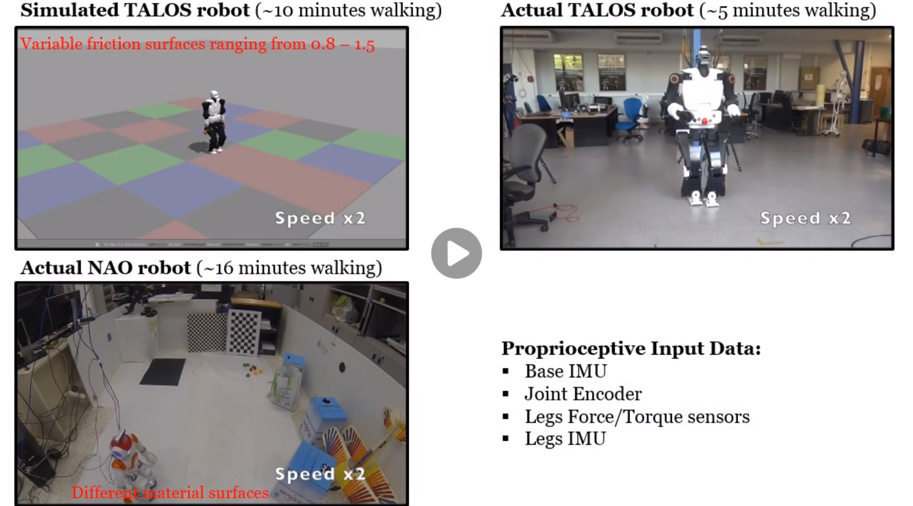

# gem2_state_publisher
gem2_state_publisher is ROS/C++ utility package for the Gait-Phase Estimation Module 2 (GEM2) available at  https://github.com/mrsp/gem2 to generate the mandatory input and facilitate real-time gait-phase estimation. The code is open-source (BSD License). Please note that this work is an on-going research and thus some parts are not fully developed yet. Furthermore, the code will be subject to changes in the future which could include greater re-factoring.

## GEM2 data aqcuisition in real-time

### Published Topics
* /gem2/rel_base_imu
* /gem2/rel_CoM_velocity
* /gem2/rel_LLeg_wrench
* /gem2/rel_RLeg_wrench
* /gem2/rel_LLeg_imu
* /gem2/rel_RLeg_imu
### Optional Published Topics
* /gem2/rel_CoM_position
* /gem2/rel_LLeg_pose
* /gem2/rel_RLeg_pose
* /gem2/rel_LLeg_velocity
* /gem2/rel_RLeg_velocity
* /gem2/ground_truth/gait_phase (if provided)

## Prerequisites
* Ubuntu 16.04 and later
* ROS kinetic and later
* Eigen 3.2.0 and later
* [Pinocchio](https://github.com/stack-of-tasks/pinocchio) 2.2.1

## Installing
* sudo apt-get install ros-kinetic-pinocchio
* git clone https://github.com/mrsp/gem2_state_publisher.git
* catkin_make -DCMAKE_BUILD_TYPE=Release 
* If you are using catkin tools run: catkin build  --cmake-args -DCMAKE_BUILD_TYPE=Release 

## Run in real-time to provide a synchronized data stream:
* configure appropriately the config yaml file (in config folder) with the corresponding topics 
* roslaunch gem2_state_publisher gem2_state_publisher.launch
